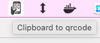

# Clipboard to QR-Code

## Usage

Shows an icon in your system tray : 



A simple click on it shows the content of your clipboard in a simple QRCode : 


## Build

Needs Java and Maven

```
mvn clean compile assembly:single
```

## Run

```
java -jar target/qr-code-clipboard-1.0-SNAPSHOT-jar-with-dependencies.jar
```


 